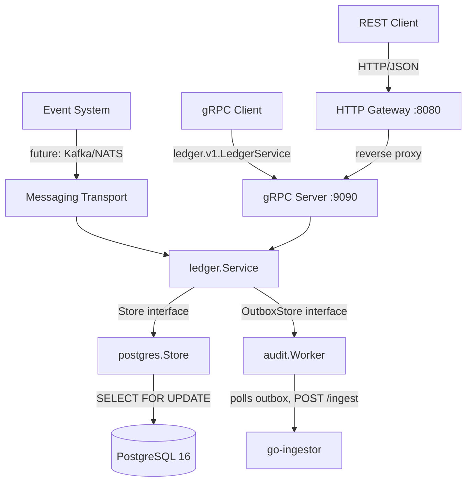

# go-ledger

A bank-grade financial transaction service built in Go. Designed to be the central financial brain that microservices talk to when they need to move value safely.


## Architecture



### Why hexagonal architecture

go-ledger has three input transports: gRPC, HTTP Gateway, and a future event consumer. Hexagonal architecture isolates the domain from all of them — the service layer never imports gRPC, HTTP, or Postgres packages. Each transport is a plug-in adapter.

### The dependency flow (strictly one-directional, no cycles)

```
cmd/ledger (composition root)
    ↓
internal/ledger (domain: types + Store port + OutboxStore port + Service)
    ↓ implements Store          ↓ implements OutboxStore
internal/store/postgres     internal/audit
    ↓
PostgreSQL
```

## How Money Moves (Double-Entry Bookkeeping)

Money is never "changed" — it is only *moved*. Every transaction produces exactly two ledger entries:

```
Transfer $10 from Alice → Bob:

entries table:
  account_id=alice  amount=-10  (DEBIT)
  account_id=bob    amount=+10  (CREDIT)

invariant: SELECT SUM(amount) FROM entries = 0  (always)
```

The `balance` column on the `accounts` table is a denormalized cache updated atomically inside the same DB transaction. If the entries and balances ever disagree, the system has a bug.

## Race Condition Prevention

Two goroutines trying to spend from the same wallet at the same millisecond:

```sql
BEGIN;
-- Locks both account rows. Any other transaction touching these rows WAITS.
SELECT id, type, currency_code, balance
FROM accounts
WHERE id = ANY($1::uuid[])
ORDER BY id          -- ← always same order, prevents deadlock
FOR UPDATE;

-- Check balance in Go against locked data
-- Insert entries and update balances
COMMIT;
-- Locks released. Next waiting transaction proceeds.
```

Without `SELECT FOR UPDATE`: two goroutines read `balance=100`, both think they can spend `$100`, both succeed → balance goes to `-$100`. With it: one waits, reads the updated balance `0`, returns `ErrInsufficientFunds`.

## Idempotency

Clients generate a UUID **before** sending the request. If the network times out:

```
Client → sends request with idempotency_key="abc-123"
Server → processes, commits, returns response
Network → drops the response
Client → retries with same idempotency_key="abc-123"
Server → sees ON CONFLICT DO NOTHING, returns original transaction
Money → moved exactly once
```

## API Documentation

Swagger UI is available at `http://localhost:8080/swagger/` when the service is running. The raw OpenAPI spec is at `http://localhost:8080/swagger.json`.

## i18n

Error messages are translated based on the client's `Accept-Language` header. Supported languages: **English** (default) and **Farsi**. Every error response includes a `messageCode` field (e.g. `INSUFFICIENT_FUNDS`) that clients can use to render their own localized strings independently of the server-side translations.

## Tech Stack

| Layer | Technology |
|---|---|
| Language | Go 1.26 |
| Database | PostgreSQL 16 |
| Primary transport | gRPC |
| REST transport | gRPC-Gateway (auto-generated) |
| API contract | Protocol Buffers v3 + Buf |
| Migrations | golang-migrate |
| Logging | `log/slog` (JSON) |
| Metrics | Prometheus |
| Config | koanf |
| i18n | Built-in (English + Farsi) |

## Quick Start

**Prerequisites:** Go 1.26+, Docker, `buf`, `golang-migrate`, `grpcurl`

```bash
# Clone and configure
git clone https://github.com/mohammad-farrokhnia/go-ledger.git
cd go-ledger
cp configs/config.example.yaml configs/config.yaml
# Edit configs/config.yaml — at minimum set database.dsn

# Start Postgres
make up

# Run migrations (requires DB_DSN env var or set in .env)
make migrate

# Start the service
make run
```

The service starts two ports:
- `:9090` — gRPC
- `:8080` — HTTP gateway + Swagger UI (`/swagger/`) + health (`/health`) + metrics (`/metrics`)

## API Examples

### Create wallets

```bash
# SYSTEM wallet — platform revenue account (can go negative, used to mint money)
grpcurl -plaintext -d '{
  "name": "platform-revenue",
  "type": "ACCOUNT_TYPE_SYSTEM",
  "currency_code": "USD"
}' localhost:9090 ledger.v1.LedgerService/CreateWallet

# USER wallet
grpcurl -plaintext -d '{
  "name": "alice",
  "type": "ACCOUNT_TYPE_USER",
  "currency_code": "USD"
}' localhost:9090 ledger.v1.LedgerService/CreateWallet
```

### Top up a user wallet (mint money from SYSTEM)

```bash
grpcurl -plaintext -d '{
  "idempotency_key": "topup-alice-001",
  "from_account_id": "<SYSTEM_ID>",
  "to_account_id": "<ALICE_ID>",
  "amount": 10000,
  "currency_code": "USD"
}' localhost:9090 ledger.v1.LedgerService/CreateTransaction
```

### Check balance via REST

```bash
curl http://localhost:8080/v1/wallets/<ALICE_ID>/balance | jq .
```

### Retry with same idempotency key (safe — returns original)

```bash
# Sending the same request again returns the original transaction, money moves once
grpcurl -plaintext -d '{
  "idempotency_key": "topup-alice-001",
  "from_account_id": "<SYSTEM_ID>",
  "to_account_id": "<ALICE_ID>",
  "amount": 10000,
  "currency_code": "USD"
}' localhost:9090 ledger.v1.LedgerService/CreateTransaction
```

### Health check

```bash
curl http://localhost:8080/health | jq .
# {
#   "data": {"status": "ok", "version": "1.0.0", "app": "go-ledger", "checks": {"postgres": "ok"}},
#   "meta": {"appName": "go-ledger", "version": "1.0.0", "timestamp": "...", "messageCode": "HEALTH_OK", "message": "healthy"}
# }
```

### Prometheus metrics

```bash
curl http://localhost:8080/metrics | grep ledger
# ledger_transactions_total{status="success",error_type=""}
# ledger_transactions_total{status="fail",error_type="insufficient_funds"}
# ledger_transaction_duration_seconds_*
# ledger_db_errors_total
# ledger_grpc_active_connections
```

## Developer Commands

```bash
make up            # start Postgres + pgAdmin (localhost:5050)
make down          # stop containers, keep data
make down-volumes  # stop containers, delete all data
make migrate       # run migrations on dev DB
make migrate-test  # run migrations on test DB
make gen           # regenerate proto → Go + Swagger
make lint          # run golangci-lint
make test          # run all tests with -race flag
make run           # run the service (reads .env)
make db            # open psql shell
make help          # list all targets
```

## Configuration

The service loads `configs/config.yaml` first, then overlays any matching environment variables. Create your config by copying the template:

```bash
cp configs/config.example.yaml configs/config.yaml
```

The Makefile (`make migrate`, `make db`) reads a `.env` file for convenience — create one with `DB_DSN=...` if needed. Never commit `.env`.

| Variable | Default | Description |
|---|---|---|
| `DB_DSN` | required | Postgres connection string |
| `GRPC_PORT` | `9090` | gRPC server port |
| `HTTP_PORT` | `8080` | HTTP gateway port (also serves `/metrics`, `/health`, `/swagger/`) |
| `AUDIT_MODE` | `async` | `sync` blocks, `async` fire-and-forget |
| `AUDIT_HOOK_URL` | — | go-ingestor endpoint, disabled if empty |
| `LOG_LEVEL` | `info` | `debug`, `info`, `warn`, `error` |
| `COMPOSE_PROJECT_NAME` | `docker` | Docker Compose project name |

## Running Tests

```bash
# Ensure test DB is migrated
make migrate-test

# Run all tests including concurrency tests
make test

# The key tests to look at:
# TestCreateTransaction_ConcurrentDeductions  — 50 goroutines, proves no race
# TestCreateTransaction_ConcurrentContention  — 100 goroutines, proves ErrInsufficientFunds
# TestCreateTransaction_Idempotency           — same key twice, money moves once
```

## Building the Docker Image

```bash
docker build -f deployments/docker/Dockerfile -t go-ledger:latest .

# Run with docker compose (includes Postgres)
docker compose -f deployments/docker/docker-compose.yml up
```

## Error Reference

| Error | gRPC Code | Meaning |
|---|---|---|
| `account not found` | `NOT_FOUND` | Account ID does not exist |
| `transaction not found` | `NOT_FOUND` | Transaction ID does not exist |
| `insufficient funds` | `FAILED_PRECONDITION` | Sender balance too low |
| `currency mismatch between accounts` | `INVALID_ARGUMENT` | Accounts have different currencies |
| `transaction with this idempotency key already exists` | `ALREADY_EXISTS` | Duplicate — fetch original |
| `amount must be greater than zero` | `INVALID_ARGUMENT` | Invalid amount |
| `source and destination accounts must be different` | `INVALID_ARGUMENT` | Same account |
| `invalid account type` | `INVALID_ARGUMENT` | Account type is not USER or SYSTEM |
| `currency code must be a 3-letter ISO 4217 code` | `INVALID_ARGUMENT` | Malformed currency code |
| `an internal error occurred` | `INTERNAL` | Server error (details logged server-side) |

## Project Structure

```
api/proto/ledger/v1/   proto definition + generated Go code
cmd/ledger/            entrypoint — composition root only
configs/               config.yaml template
deployments/docker/    Dockerfile + docker-compose
docs/                  API documentation
internal/
  audit/               outbox worker — polls DB, POSTs events to webhook
  config/              koanf config loader
  i18n/                error message translation (English + Farsi)
  ledger/              domain: types, errors, Store/Auditor ports, Service
  metrics/             Prometheus metric definitions
  store/postgres/      Postgres implementation of ledger.Store
  transport/grpc/      gRPC server, handler, interceptors, mappers
  transport/http/      gRPC-Gateway, health check, Swagger UI, error handler
migrations/            SQL migration files (up + down)
pkg/
  apperr/              structured application error type
  response/            HTTP response envelope helpers
```
